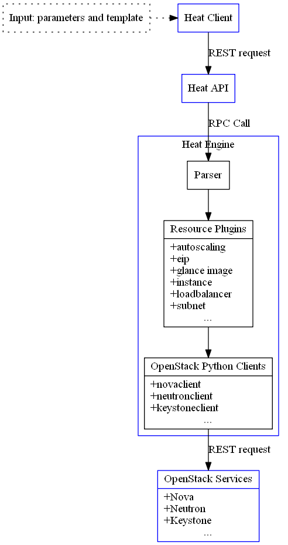

# 调用逻辑
整体的调用逻辑如下图所示。

* heat-client，接受输入命令、参数和模板（URL、文件路径或数据），处理信息后转为 REST API 请求发送到 heat-api 服务。
* heat-api，接受请求，读入模板信息，处理后利用 rpc 请求发送给 heat-engine。
* heat-engine，解析模板数据，调用各种资源插件。
* resource-plugins，各种资源插件通过 OpenStack 的 clients 发送指令到 OpenStack 服务。
